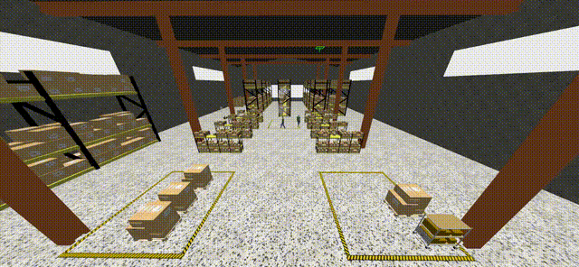

# Dynamic_Smoking_Gazebo_Env

<table width="100%">
<tr>
	<td width="33%">
		
	</td>
    <td width="33%">
		
	</td>
    <td width="33%">
		
	</td>
</tr>
<tr>
	<td width="33%">
		
	</td>
    <td width="33%">
		
	</td>
    <td width="33%">
		
	</td>
</tr>
</table>

Based on this [particle emitter](https://github.com/gazebosim/gz-sim/blob/f6efeefb4ab99284d1a053061235f8c2fa02a5da/src/systems/particle_emitter/ParticleEmitter.hh), we focus on providing multiple integrated indoor and outdoor smoke scenes in the Gazebo simulation environment, ultimately completing our needs for smoke simulation in various environments.

You can download it via [Baidu Cloud Disk](https://pan.baidu.com/s/1jZnC0b1YVsV8pNyruDp0Vw?pwd=tm3l)
